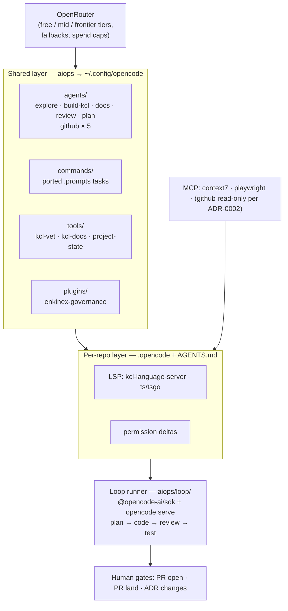

# OpenCode Agent Loop — Migration & Automation Plan

> enkinex-aiops v0.2.0 — Replace the Claude Code control plane with an
> opencode + OpenRouter agent loop: multi-model routing, granular
> governance, LSP/MCP integration, custom tools/plugins via the
> opencode SDK, and headless plan → code → review → test automation.

## 1. Context & Goal

The four enkinex subprojects were built with Claude Code through a human-in-the-loop plan → code → review → test
workflow. enkinex-aiops holds the reusable prompts (`.prompts/*.yaml`), the five GitHub workflow skills
(`.claude/skills/`), and the permission posture (`.claude/settings.json`).

This plan migrates that control plane to **opencode** (installed:
v1.18.11) with **OpenRouter** as the model gateway, and raises autonomy: a standard **Agent Loop** that routes each task
to a model tier matched to its complexity, enforces governance mechanically, and runs unattended up to explicit human
gates.

Success means: any enkinex repo can execute planned (`plan/`) work through opencode with (a) the same locked GitHub
conventions, (b) models chosen per task complexity from OpenRouter, (c) KCL/TS language-server feedback in the loop, (d)
reusable shared agents authored once in enkinex-aiops, and (e) a scriptable loop runner for unattended plan → code →
review → test cycles.

## 2. Current State (at migration start, 2026-08-03 — historical snapshot)

| Repo                  | Assets relevant to the loop                                                                                                                                                           |
|-----------------------|---------------------------------------------------------------------------------------------------------------------------------------------------------------------------------------|
| `enkinex-aiops`       | `CLAUDE.md`; `.claude/skills/` × 5; `.claude/settings.json`; `.project/` (conventions, ADR-0001, backlog, plan); `.prompts/` YAML task-specs (odcs × 11, website × 4, plan, factored) |
| `enkinex-odcs`        | KCL ODCS v3.1.0 library, 6 modules; `Justfile` (`init/fmt/lint/docs/test/check`); `kcl vet` fixtures                                                                                  |
| `enkinex-odps`        | KCL ODPS v1.0.0 library, 7 modules; identical `Justfile` ergonomics                                                                                                                   |
| `enkinex-org-website` | Docusaurus 3 + TS + Playwright + Wrangler; tutorials for ODCS/ODPS; rest TODO                                                                                                         |
| Machine               | opencode 1.18.11; empty global `~/.config/opencode/opencode.jsonc`; `@opencode-ai/plugin` available; `kcl` + `kcl-language-server`; no OpenRouter auth yet                            |

## 3. Claude Code → opencode artefact mapping

| Claude Code artefact                   | opencode equivalent                                                                                         | Where authored                     |
|----------------------------------------|-------------------------------------------------------------------------------------------------------------|------------------------------------|
| `CLAUDE.md`                            | `AGENTS.md` (+ synced `AGENTS.shared.md` via `instructions`)                                                | aiops → sync; per-repo overlays    |
| `.claude/skills/<name>/SKILL.md`       | `opencode/agent/<name>.md` in aiops → synced to `.opencode/agent/` (subagent, model + permission frontmatter) and/or `opencode/command/<name>.md` | aiops → sibling repos |
| `.claude/settings.json` allow/ask/deny | `permission` rules in `opencode.jsonc` (allow/ask/deny globs)                                               | aiops → sibling repos + overlays   |
| `.prompts/*.yaml` task specs           | `loop/tasks/*.yaml` consumed by the SDK loop runner (Phase 5); `.prompts/` deleted once ported              | aiops                              |
| hooks / mechanical enforcement         | `opencode/plugin/*.ts` in aiops → synced to `.opencode/plugin/` (`tool.execute.before/after`, `event` hooks) | aiops → sibling repos              |
| — (new)                                | `opencode/tool/*.ts` in aiops → synced to `.opencode/tool/` (`kcl-vet`, `kcl-docs`, `project-state`)        | aiops → sibling repos              |
| ADR prose describing workflows         | **Not ported.** Workflows become executable artefacts (agents, commands, loop tasks, plugin hooks)          | aiops → sibling repos              |

### 3.1 Executable governance — the ADR boundary (locked principle)

**Workflows are code, not documents.** The entire CI/CD workflow (branch → commit → PR → review → land) and every
other procedural convention are defined **once** as executable artefacts — `.opencode/agent/*.md`,
`.opencode/command/*.md`, `loop/tasks/*.yaml`, and `enkinex-governance` plugin hooks. These artefacts are the single
source of truth: they both *describe* the workflow (readable Markdown/YAML) and *execute/enforce* it.

ADRs shrink to their only irreplaceable role: recording **one-way decisions and their rationale** (e.g. "gh-CLI for
mutations", "two-layer distribution", "Kimi 3 default frontier"). An ADR is one page — context, decision,
consequences, and links to the executable artefacts that carry the decision out. If a rule can be enforced by an
agent, command, task, or hook, it must not live in an ADR.

Consequences:

- Convention docs are **retired** (`.project/conventions/` was removed in the 2026-08-03 cleanup): human-readable
  rule summaries live in each repo's CONTRIBUTING guide and the shared `AGENTS.shared.md` — they describe what the
  agents enforce and link to the artefacts, never the reverse.
- A workflow change is a PR against the executable artefact (with golden-set regression per Phase 6), not a doc edit.
- ADR count stays near-zero after Phase 0; new ADRs require the human gate already in the architecture diagram.

## 4. Distribution model (decided — ADR-0005)

Flat siblings, **repo-local** distribution — the pseudo-multirepo nesting (siblings cloned inside aiops and
gitignored) is abandoned, and the earlier home-layer design (ADR-0003) was superseded after review: syncing into
`~/.config/opencode/` violates contributor sovereignty and makes governance opt-in. Governance travels with the repo:

1. **Shared layer (versioned in aiops `opencode/`, synced into each sibling repo):** baseline `opencode.jsonc`,
   `shared/AGENTS.md`, and `agent/ command/ tool/ plugin/` as they land. `just sync-opencode` copies them to
   `<repo>/opencode.jsonc` and `<repo>/.opencode/…`; `just verify-opencode` reports checksum drift. Synced files carry
   a GENERATED header and are committed in the target repo via its normal PR flow — distribution happens through
   `git clone`, never through home-dir mutation.
2. **Repo overlay (hand-owned, per repo):** `<repo>/.opencode/opencode.jsonc` (loaded after the root config, so it
   wins — verified empirically) carries repo deltas (LSP servers, model overrides); repo-root `AGENTS.md` carries
   repo-specific instructions (repo map, commands, test entry points).

Rationale: governance is active on clone for every contributor; personal global config is never touched; every
governance change is a reviewable repo diff; drift stays detectable via the verify recipe.

## 5. Model tiering on OpenRouter (3-tier)

Pinned per agent in frontmatter; revalidated by the Phase 0 benchmark. Free-tier IDs are `:free` suffixed and rotate —
verify at implementation time and record the final pins in this plan's Outcome.

| Tier         | Used for                                                                                | Candidate models (OpenRouter)                                                                      |
|--------------|-----------------------------------------------------------------------------------------|----------------------------------------------------------------------------------------------------|
| **Free**     | explore/triage, formatting, lint-fix, mechanical checks, session titles (`small_model`) | `qwen/qwen3-coder:free`, `deepseek/deepseek-chat-v3-0324:free`, `google/gemini-2.0-flash-exp:free` |
| **Mid**      | routine code edits, docs/tutorials, test authoring, KCL module work                     | `moonshotai/kimi-k2`, `google/gemini-2.5-flash`, `deepseek/deepseek-chat` (paid)                   |
| **Frontier** | plan authoring, schema-vs-standard review, architecture, ADRs, final PR review          | `moonshotai/kimi-3` (**default**), `anthropic/claude-opus-5`, `openai/gpt-5.6` family              |

**Frontier policy (locked):** the frontier tier is restricted to **Claude Opus 5**, the **GPT 5.6 family**, and
**Kimi 3**. Gemini is excluded from frontier work due to observed coding hallucinations. **Kimi 3 is the default
frontier model** — its outputs are benchmarked against the results previously obtained with Claude Opus 5 on enkinex
tasks, and Opus 5 remains the quality reference for that comparison.

Governance: OpenRouter provider routing + fallback chains per agent (fallbacks stay inside the same tier — frontier
agents fall back only across Kimi 3 / Opus 5 / GPT 5.6); monthly spend caps in the OpenRouter dashboard;
per-run cost logged by the loop runner (Phase 5) into `loop/loop-log.md`.

## 6. Target architecture

## 7. Phases

### Phase 0 — Discovery & decisions

- Write `discovery/opencode/migration.md`: full artefact inventory (done above), opencode capability validation
  against this plan (agent/command/tool/plugin config shapes, permission globs, LSP config, MCP transports,
  `opencode run`/`serve`, SDK surface).
- **ADR-0002 — opencode adoption + GitHub posture revisit**
  (supersedes ADR-0001 where noted): decide the new GitHub surface. Proposal to evaluate: keep gh-CLI for mutations;
  allow GitHub MCP **read-only** for PR/review context; allow CI-triggered headless loop runs (opencode serve) if a
  concrete need lands — otherwise local `just loop` only. Record the verdict in the ADR.
- **ADR-0003 — two-layer distribution model** (Section 4).
- **ADR-0004 — executable governance** (Section 3.1): the ADR boundary. This is the **last** ADR that describes a
  process; from here on the CI/CD workflow and all procedural conventions are authored as agents, commands, loop
  tasks, and plugin hooks (Phases 2/4/5), and ADR-0002/0003 themselves stay one-page decision records linking to
  those artefacts.
- **Model benchmark:** run 3 representative enkinex tasks (KCL schema-vs-standard review, Docusaurus docs edit,
  Justfile-guarded test fix) against 2 candidates per tier; record quality/cost/latency; pin tiers. For the frontier
  tier, run **Kimi 3 first** and score it against the archived Claude Opus 5 results from the Claude Code era
  (schema reviews, release plans, docs) before deciding whether Opus 5 or GPT 5.6 stays as the frontier fallback.
  **Executed as `plan/opencode/benchmark-enkinex-databricks.md`**: the benchmark vehicle is a real fifth project,
  `enkinex-databricks` (KCL library for Databricks Asset Bundles), built end-to-end by the loop itself (task ladder
  T0–T8, scoring rubric, Opus 5 baseline comparison).

Acceptance: discovery doc + ADR-0002 + ADR-0003 + ADR-0004 committed; tier pins recorded with benchmark evidence.

**Phase 0 status (2026-08-03):** discovery doc landed at `discovery/opencode/migration.md`; ADR-0002,
ADR-0004, ADR-0005 landed in `architecture/` (root-level after the `.project` cleanup); benchmark defined in
`plan/opencode/benchmark-enkinex-databricks.md`; `enkinex-databricks` T0 scaffold green (`kcl fmt/lint/vet`).
Remaining: tier pins via benchmark tasks T1–T8 (prerequisites: install `just` + Databricks CLI, OpenRouter auth,
Phase 1–2 artefacts).

### Phase 1 — Foundation config & auth

- `opencode auth login` with the OpenRouter key (env
  `OPENROUTER_API_KEY` documented as the CI/headless path).
- Author shared baseline `opencode.jsonc` in aiops: `$schema`, provider `openrouter`, default `model`, `small_model`
  (free tier),
  `instructions` including `AGENTS.shared.md`, and the ported **permission posture** (allow:
  `git status/diff/log/branch`,
  `kcl *`, `just *`; ask: `git commit`, `git push`, `gh pr merge`, destructive git; deny: secrets paths, and whatever
  ADR-0002 keeps denied for `gh issue/project/workflow/run/release`).
- Convert aiops `CLAUDE.md` → `AGENTS.md`; write per-repo `AGENTS.md`
  stubs for odcs/odps/website (repo map, Justfile commands, test entry point, plan-reference rule).
- `just sync-opencode` + `just verify-opencode` in aiops.

Acceptance: `opencode run "summarize this repo"` succeeds in each of the 4 repos using the tiered default model; a
denied command is blocked mechanically; verify recipe reports zero drift.

**Phase 1 status (2026-08-03):** OpenRouter auth via `OPENROUTER_API_KEY` (env, ~/.bashrc). Shared layer authored in
aiops `opencode/` (`opencode.jsonc` with ported allow/ask/deny posture + tiered model pins, `shared/AGENTS.md`).
**Distribution corrected to repo-local (ADR-0005, superseding ADR-0003)** after review: synced files are committed in
each sibling repo; `$HOME/.config/opencode` reverted to a pristine stub and is never written. Clean aiops `AGENTS.md`
replaced the Claude-era CLAUDE.md (now a deprecation stub). Per-repo `AGENTS.md` stubs committed on
`docs/opencode-agents-stub` branches in all 4 siblings (not pushed). Smoke tests: `opencode run` green in aiops +
databricks (mid + free tiers); `gh issue list` **blocked mechanically** by the deny rules; config load order verified
empirically (root `opencode.jsonc` → `.opencode/opencode.jsonc`, later wins). Free-tier note: `gemma-4-31b-it:free`
rate-limits upstream — `small_model` pinned to `nvidia/nemotron-3-nano-30b-a3b:free`. All work on branch
`proj/aiops-opencode-foundation`, awaiting PR.

### Phase 2 — Agents & commands

> Revised 2026-08-03 (post-cleanup): the `.claude/skills/` sources are deleted (git history only) and the convention
> docs are retired. Agents are **authored fresh** in aiops `opencode/agent/` — the rules come from `AGENTS.shared.md`
> and ADR-0002 — and synced to each sibling's `.opencode/agent/` (ADR-0005). These files are the CI/CD workflow
> definition (ADR-0004): slug grammar, commit format, footer rules, PR template, and merge path live here and only
> here; `AGENTS.shared.md` and CONTRIBUTING guides summarize them.

- GitHub workflow agents (`mode: subagent`, per-agent `permission` scopes, enkinex-remote guard that aborts on
  non-enkinex origins):
    - `git-branch` (mid) — fetch + sync check, slug grammar `<type>/<short-slug>`.
    - `git-commit` (mid) — Conventional Commits subset, `Refs:` footer to `plan/`, explicit-path staging, secret
      scan.
    - `pr-open` (mid) — `gh pr create` with the locked template (Summary / Plan reference / Test plan / Notes);
      refuses without a `plan/` reference unless an explicit opt-out justification is given.
    - `pr-review` (frontier: kimi-k3) — `gh pr view --json` filtered status + diff-quality review.
    - `pr-land` (mid) — re-confirm authorisation; `gh pr merge --squash --delete-branch`; verify footers survive.
- Chain them as commands: `/ci-start <task>`, `/ci-commit`, `/ci-open-pr`, `/ci-review-pr`, `/ci-land` — the
  human-driven form of the workflow; Phase 5 automates the same chain headlessly.
- New loop agents:
    - `explore-enkinex` (free tier, read-only) — codebase research.
    - `build-kcl` (mid tier) — KCL library edits guarded by `just check`.
    - `docs-writer` (mid tier) — Docusaurus/tutorials/README.
    - `review-standard` (frontier: kimi-k3) — schema-vs-standard review, rules derived from the
      `.prompts/odcs/review.yaml` rule set (docstring format, required/optional fidelity, YAML→KCL examples).
    - `plan-author` (frontier: kimi-k3) — `plan/v*.md` authoring.
- `.prompts/*.yaml` is **not** ported to commands: those one-off historical specs are the precedent corpus for
  Phase 5 loop task specs (`loop/tasks/*.yaml`) and the `review-standard` rule seed. `.prompts/` is deleted once
  Phase 5 lands. Commands are reserved for the recurring human-driven entry points (`/ci-*`).

Acceptance: all agents appear in `opencode agent list`; a `/ci-*` command delegates to its agent; verify recipe
reports zero drift after sync. **The remote guard acceptance moves to Phase 4** (see status note).

**Phase 2 status (2026-08-03/04):** 10 agents + 5 `/ci-*` commands authored in aiops `opencode/agent|command/`,
synced to all siblings, zero drift; `opencode agent list` shows all 10; aiops uses committed symlinks
(`.opencode/agent` → `../opencode/agent`, same for `command`) so the sources are live here without duplication.
**Two findings that change later phases:**
1. *Prompt guards are advisory.* In a scratch repo with a non-enkinex origin, `git-branch` (kimi-k2) created the
   branch anyway — the remote-abort instruction was ignored even after hardening ("FIRST tool call" imperative).
   The remote guard is therefore **defense-in-depth prose**; mechanical enforcement is mandatory in the Phase 4
   `enkinex-governance` plugin (`tool.execute.before` hook intercepting git/gh mutations and checking origin).
2. *Headless `ask` auto-rejects.* `opencode run` rejects `ask`-level calls without a human. The Phase 5 loop
   runner must either run with `--auto` (auto-approves non-denied; deny rules still hold) or answer permission
   requests via the SDK. Recorded for Phase 5 design.

### Phase 3 — LSP & MCP

- odcs/odps/databricks `.opencode/opencode.jsonc` (the hand-owned repo overlay per ADR-0005): register KCL LSP
  (`command: ["kcl-language-server"]`, extensions `[".k"]`) so the build/review agents see compiler diagnostics
  in-loop.
- website: rely on built-in TS/TSX LSP; add repo `AGENTS.md` note for
  `npm run typecheck` / Playwright.
- MCP servers in the synced baseline `opencode.jsonc`: `context7` (remote, live docs for KCL/Docusaurus/ODCS/ODPS),
  `playwright` (local, website e2e). No GitHub MCP (ADR-0002 locked this out; mutations stay gh-CLI).

Acceptance: editing a `.k` file surfaces kcl diagnostics to the agent; context7 answers a KCL doc query inside a
session; Playwright MCP drives one website page load.

**Phase 3 status (2026-08-04): DONE, except fallback chains.**

Delivered:

- **KCL LSP in the shared baseline**, not per-repo overlays (re-scoped per
  `discovery/opencode/harness-agnostic-review.md` §6.1): four of six repos are KCL libraries, and the `extensions`
  gate means a repo with no `.k` files never spawns the server. `lsp` as an *object* enables the built-ins **and**
  applies the override — confirmed from opencode's own startup log, which lists `kcl` alongside all 37 built-ins, so
  the website keeps its TS/TSX server.
- **MCP placement follows catalog size, per ADR-0002's token-economy rule.** That ADR denies GitHub MCP because a
  tool catalog is ambient per-session cost; the same argument decides placement for every server. `context7`
  (2 tools, useful in every repo) sits in the shared baseline; `playwright` (~25 tools, website-only) is declared in
  `enkinex-org-website/.opencode/opencode.jsonc`, the first hand-owned repo overlay. No GitHub MCP.

Acceptance evidence:

- Editing a `.k` file surfaced `ERROR [2:5] expected str, got int(123)` to the agent. Note that diagnostics attach on
  **edit**, not on plain `read` — a read of a broken file returns nothing.
- `opencode mcp list` reports `context7 connected` in a KCL repo and `context7 + playwright connected` in the
  website; a live `context7_resolve-library-id` call returned the Docusaurus id, unauthenticated.
- The website overlay's permission deltas merge over the baseline as intended (`npm run deploy*` deny,
  `npm run typecheck*` / `npx playwright test*` allow, baseline `just check*` preserved).

> **Correction (2026-08-11).** Two claims above were checked against the live index and one was wrong.
> KCL (`/kcl-lang/kcl-lang.io`, 3918 snippets), ODCS and ODPS (`/bitol-io/*`), Ossie (`/apache/ossie`)
> and the Databricks bundle schema (`/databricks/cli`) all resolve — but **OKF is not indexed by
> context7**, so naming it as a reason for the server was never true. The acceptance test also proved
> only that the server *connects*: no agent or loop task referenced it, so the capability sat unused
> for a week. Both are addressed in `harness-and-dogfooding.md` §2.6.

**Not delivered — OpenRouter fallback chains (§5).** No verified config path exists. `provider.<id>.options` accepts
unknown keys, and `agent.options` is free-form, but neither is documented to forward OpenRouter routing parameters
(`models`, `provider.order`, `allow_fallbacks`), and an attempt to prove it by pointing `options.baseURL` at a local
echo server captured no request at all — so the test rig could not even confirm `baseURL` passthrough. Shipping
config that silently does nothing is worse than shipping none, so none was added. Mitigating fact found while
investigating: **provider-level failover within a model is automatic at OpenRouter** (`allow_fallbacks` defaults
true), which already covers the common "provider is down" case. Only *model*-level fallback is missing. Reopen as its
own task with a working instrumentation approach, or via an OpenRouter-side preset.

### Phase 4 — Custom tools & governance plugin (SDK surface)

- `opencode/tool/kcl-vet.ts` (aiops source → `.opencode/tool/`) — wraps `just test` (kcl vet fixtures), returns
  structured pass/fail per fixture.
- `opencode/tool/kcl-docs.ts` — wraps `just docs` regeneration.
- `opencode/tool/project-state.ts` — reads `plan/` + `discovery/` (active plan, discoveries) so agents self-orient
  without prompt stuffing.
- `opencode/plugin/enkinex-governance.ts` — hooks:
  `tool.execute.before` blocks `git add -A/-.` (explicit paths only), requires `Refs:` footer on commits, and
  **mechanically enforces the enkinex remote guard** — intercepts every `git checkout -b` / `git commit` /
  `git push` / `gh pr *` bash call, runs `git remote get-url origin`, and denies the call when origin is not under
  `github.com:enkinex/` (prompt-level guards proven unreliable in Phase 2 smoke tests);
  `event` hook logs session cost/model per run.
- Optional stretch: publish as `@enkinex/opencode-plugin` npm package and consume via the `plugin` config array instead
  of file sync.

Acceptance: a staged commit without `Refs:` is refused by the plugin;
`kcl-vet` tool returns structured results inside a session.

**Phase 4 status (2026-08-04): DONE, re-shaped in two places.**

**Tools ship as one MCP server, not three `.opencode/tools/*.ts` files**
(`discovery/opencode/harness-agnostic-review.md` §6.2). Custom opencode tools are opencode-only by
construction; MCP is the one tool-extension surface opencode, Claude Code and Codex all speak, so
`mcp/enkinex.mjs` serves every harness from a single implementation. Zero dependencies and
hand-rolled JSON-RPC over stdio, matching `.githooks/` and `policy/guard.mjs`: this layer is
distributed by file copy into repos with no install step, so a server needing `npm install` before
it runs would not be governance that travels with the repo.

`kcl-vet` and `kcl-docs` landed as specified; `kcl_docs` reports the more useful signal — not that
docs regenerated, but whether the **committed** reference was stale. `project-state` landed as
`project_state` over `plan/`, `discovery/` and `architecture/`.

**The catalog is derived from the repo.** ADR-0002 denies GitHub MCP because a tool catalog is
ambient per-session cost; that applies to this server too, so it advertises only what the repo can
use. enkinex-odcs sees the two KCL tools, enkinex-aiops sees `project_state`, and
enkinex-org-website sees an **empty catalog** and pays nothing.

**The governance plugin was delivered earlier and differently.** Phase 4 specified
`opencode/plugin/enkinex-governance.ts` doing remote-guard, staging and `Refs:` enforcement. That
shipped on 2026-08-04 as `.githooks/` (git-layer rules, binding humans too) plus
`policy/guard.mjs` with three pointer-only adapters (tool-call rules, all three harnesses). The
plugin that remains, `opencode/plugin/enkinex-guard.js`, is an adapter carrying no rules.

Acceptance evidence: `opencode mcp list` reports `enkinex connected`; an agent called
`enkinex_kcl_vet` and got `PASS — all kcl vet fixtures validate`, and `FAIL` with the compiler's
diagnostics on a deliberately broken fixture. 20 regression cases in `tests/mcp.test.sh`.

**Not done — the npm-package stretch.** Publishing `@enkinex/opencode-plugin` stays deferred; file
sync is the distribution model (ADR-0005) and an npm dependency would reintroduce an install step.

### Phase 5 — The loop runner (headless automation)

- New `loop/` package in aiops (TypeScript, `@opencode-ai/sdk`,
  `opencode serve`):
    1. Reads a task spec from `loop/tasks/*.yaml` (evolved `.prompts`
       format: `task`, `specs`, `repo`, `tier` hints, `gates`).
    2. Session 1 — `plan-author` produces/updates `plan/`.
    3. Session 2 — build agent (tier from spec) implements.
    4. Session 3 — `review-standard` reviews the diff with fresh context.
    5. `just check` (or repo equivalent) must pass; loop retries once on failure, then stops.
    6. Human gate: PR open and PR land remain explicit human actions (unless ADR-0002 relaxes opening).
- `loop/tasks/github-pr-cycle.yaml` — the **CI/CD workflow as a loop task** (per ADR-0004): chains the five github
  agents (branch → commit → push → open → review → land) with the human gates declared in the spec. Running
  `just loop github-pr-cycle` *is* the local CI/CD pipeline; no YAML CI definitions, no ADR prose.
- Just recipes: `just loop <task-spec>`, `just loop-status`.
- Runs and costs appended to `loop/loop-log.md`.

Acceptance: one real dogfood task per repo completes plan → code → review → test unattended, stopping at the PR gate;
loop log records models, tokens, cost.

**Phase 5 status (2026-08-04): runner DONE; per-repo dogfooding belongs to Phase 7.**

**`opencode run` per step, not the SDK.** Phase 5 specified `@opencode-ai/sdk` over `opencode serve` for one
reason: something had to answer permission prompts with no human attached. The headless profile removed that
problem rather than solving it — it contains no `ask` rules at all, so there is nothing to answer. With the
justification gone, `opencode run` per step is simpler, needs no npm dependency, and gives each step its own
process, which is exactly the fresh context this plan wants for the review step.

**Three findings that changed the design, each from a failed run:**

1. **`opencode run --agent <subagent>` silently falls back to the default agent.** The run then uses the wrong
   model under the wrong permissions and still reports success. The five loop agents (`explore-enkinex`,
   `build-kcl`, `docs-writer`, `review-standard`, `plan-author`) are now `mode: all`; the five github workflow
   agents stay `subagent` because they are driven interactively. The runner also aborts if it ever sees the
   fallback warning.
2. **A green gate is not a completed task.** The first real run reported `ok` with `just check` green and had
   written nothing at all: the steps ran, produced no file, and the gate passed because the tree was untouched.
   Specs now declare `expect.changed` and `expect.files`, and the runner fails the run when the working tree is
   unchanged or a declared artefact is missing. This is the single most important thing separating "unattended"
   from "unattended and trustworthy".
3. **Separate processes mean nothing carries forward.** A step that reports findings "in your reply" hands them
   to no one. Prompts now support `{{previous}}` (the prior step's output) and `{{task}}`, making the handoff
   explicit per step rather than implicit and total.

**Cost.** OpenRouter's usage figure lags a request by seconds, so reading it when a run ends yields `0.0000` — a
number that looks like a measurement and is not one. The runner polls for up to 30 s and records `pending`
rather than a false zero. Per-run cost lands in `loop/runs.md`; the cumulative ledger stays in
`loop/loop-log.md` (two append-only schemas, so two files).

**The human gate is mechanical, not procedural.** The runner stopping before `git push` would be a promise;
under the headless profile push, rebase, PR creation and PR merge are *denied*, so a runaway step cannot take
those actions. The loop leaves a dirty tree for a human to review and commit.

**Free-tier finding.** `explore-enkinex` on the free model did not finish a "read every module" exploration
step within 10 minutes and had to be killed. Free tier is viable for narrow, bounded questions, not broad
codebase reads — direct evidence for the benchmark's T1 tier-pinning decision and for plan §9's
"free-tier model quality variance" risk.

**Not done — `github-pr-cycle.yaml`.** The plan wanted the five github agents chained as a loop task. That is
now largely redundant: the branch/commit/push rules it would have orchestrated are enforced by `.githooks/`
for every author, and the actions it would have taken are denied to a headless runner by design. Reconsider in
Phase 7 as a human-driven `/ci-*` chain rather than a loop task.

Acceptance evidence: `tests/loop.test.sh` drives the runner against a stubbed `opencode` — 18 deterministic
cases covering spec validation, dry run, placeholder substitution, the false-green regression, missing declared
output, subagent fallback, step failure, and exactly one repair attempt on a red gate. Per-repo dogfooding is
Phase 7's job, not a second implementation of it here.

### Phase 6 — Observability, cost & enterprise hardening

**Phase 6 status (2026-08-04): ledger and regression suite DONE; agent-output evals not delivered.**

**Cost ledger — `just ledger` → `loop/loop-log.md`.** The source of truth is OpenRouter's `/api/v1/key`
(JSON, and the billing system of record); `opencode stats` is parsed best-effort as an *independent*
cross-check, with the delta recorded per row. This inverts the original design: a ledger whose only source is
the thing being measured cannot detect its own blind spots — a persistent negative Δ is spend on the key that
opencode did not produce (another harness, or a stray script). First row reconciles at
Δ −$0.0348 on $13.38, i.e. rounding.

Two findings while building it:

- `opencode stats --days N` returns an identical Total Cost for N = 1, 2 and 30 — **the flag does not window
  cost** on this build. Both cost columns are therefore cumulative; comparing an unwindowed opencode figure
  against OpenRouter's *daily* usage would have manufactured a discrepancy that is not real.
- **The OpenRouter key has no spend limit** (`limit: null`). The ledger warns on every run. Per-key limits are
  the only cost control that holds regardless of which harness spends the money, so this is the one Phase 6
  item that cannot be closed from inside the repo — it needs an action at openrouter.ai/settings/keys, or
  per-tier keys via the management API (review R7).

**Golden-set regression — `just test`, gated by `just check`.** 154 deterministic cases, 14 s, zero token cost,
across four suites in `tests/`:

| Suite | Cases | Covers |
|---|---|---|
| `hooks.test.sh` | 39 | commit grammar, repo-name scope, secret paths and content, remote guard, branch slug, main pushes, history rewrites — plus the hooks committing their own source |
| `guard.test.sh` | 37 | hook bypasses, implicit staging, human-gated commands, credential paths, chained segments, both harness response shapes, and the near-misses that must stay allowed |
| `config.test.sh` | 18 | the permission posture **as opencode resolves it** — destructive git denied, no blanket `just *`, and zero `ask` rules surviving in the headless profile |
| `agents.test.sh` | 60 | frontmatter completeness, every model pin resolving against the live OpenRouter catalog, commands pointing at agents that exist, no agent re-opening `just *`, workflow agents denying edit/write |

This deliberately departs from the plan's "3 frozen fixtures, diff the outputs". Diffing LLM output is a weak
gate: it is nondeterministic, costs tokens per run, and would not have caught a single one of the four real
defects found while building this layer (a `grep` pattern parsed as options so the secret scan never ran; a
plugin spawning the wrong binary so every guard call silently allowed; `.opencode/tool` never being read; a
scope convention contradicting every CONTRIBUTING.md). Deterministic assertions over the artefacts catch that
class, run in seconds, and therefore actually get run.

**Not delivered — agent-output evals.** The LLM half of the golden set (promptfoo or equivalent, asserting
that `review-standard` still emits its five sections, that `git-commit` still produces a `Refs:` footer) needs
three decisions that are the user's: which tier to evaluate on, the acceptable cost per run, and the pass
threshold under nondeterminism. Designed, not built; `.agents/evals/` is the intended home.

**Not adopted — OpenTelemetry.** Review R6 proposed `experimental.openTelemetry` for the ledger. Rejected for
now: it requires a collector to be useful, and OpenRouter's key API already supplies authoritative cost with
no new infrastructure. Revisit when there is a reason to trace *inside* a run rather than account for it.

- Per-run model/token/cost ledger (plugin event hook + loop log); monthly OpenRouter budget alert documented.
- Golden-set regression: 3 frozen fixtures (one per repo) re-run on any agent/prompt change; diff the outputs.
- Secrets hygiene check (deny globs + plugin scan of staged paths).
- Update aiops `README.md` and `AGENTS.md` to describe the loop. ~~Archive Claude-era artefacts~~ **Done early
  (2026-08-03 cleanup): `CLAUDE.md`, `.claude/`, `.project/conventions/`, `.project/backlog/`, the Claude-era
  discovery, ADR-0001/0003 records, and the personal `.prompts/factored/` content were deleted; `.project/` was
  dissolved into root-level `architecture/` + `discovery/`; `.gitignore` was cleaned of pseudo-multirepo entries.**

### Phase 7 — Distribution & dogfood

- `just sync-opencode` installs the shared layer; per-repo overlays committed per sibling on conventional branches
  (`feat/aiops-adopt-opencode`), PRs via the ported agents.
- Dogfood each repo end-to-end (Phase 5 acceptance) and record the outcome in this plan's Outcome section; move plan to
  `plan/done/`.

**Phase 7 status (2026-08-04): distribution DONE and six PRs open; dogfooding partially delivered.**

**Distribution.** The shared layer is installed and committed in all six repos, `just verify-opencode` reports zero
drift, and six adoption PRs are open for human review. Branches were renamed before pushing: four siblings carried
`docs/opencode-agents-stub` while holding feature work, which the new slug grammar allows but which mislabels the
change.

**Two defects found by the pre-push safety review, both of which would have shipped:**

1. **The remote guard would have refused every outside contribution.** `enkinex-odcs`, `enkinex-odps` and
   `enkinex-okf` are public and take forks, and a fork's origin is `github.com/<contributor>/…` — so `pre-commit`
   blocked every commit a forker made and `pre-push` blocked every push to their own fork, while `AGENTS.md`
   instructs them to enable the hooks. A guard against agents straying into foreign clones had become a wall
   against the project's own contributors. `pre-commit` now warns; `pre-push` matches on repository *name*, so a
   fork passes and an unrelated remote is still refused.
2. **The fork fix was synced but not committed in the siblings**, so their PRs would have shipped the
   fork-blocking version. Caught by `gh pr create`'s uncommitted-changes warning on the first PR.

**Security review of what was published.** All six branch diffs scanned: zero credential-shaped strings, zero
absolute local paths, zero environment values, zero secret-shaped files. The public repos receive only enforcement
scripts, pointer adapters, agent definitions and config — no library code, schemas, fixtures or docs are touched.
The public repos reference the private `enkinex-aiops` by name 17 times in GENERATED headers; a repo name is not
sensitive, and the message ("change the source there, not here") is the correct instruction.

**Dogfooding: partial, and honestly so.** The loop is proven end to end against `enkinex-okf` — status `ok`,
declared artefact produced, gate green, human gate held. Every run against `enkinex-odcs` hangs with no output
from step 1 while the identical invocation by hand completes in ~30 s; it reproduces under `just loop`, under the
script directly, and on both tiers. That blocks the remaining per-repo runs and is Phase 1 of the successor plan.

**Succeeded by `plan/opencode/harness-and-dogfooding.md`** — three phases: harness pending tasks (including the
odcs hang, agent-output evals, model-level fallback, the `--no-verify` backstop and the unset OpenRouter spend
limit), then OKF Dogfooding (which creates the `enkinex-docs` / `enkinex-knowledge-base` repo), then Databricks
Dogfooding (which still needs the Databricks CLI). This plan moves to `plan/done/` once the six PRs land.

## 8. Scope boundaries

1. No git history rewrite; conventions apply going forward.
2. The root-level lifecycle (`discovery/` → `plan/` → `plan/done/`, ADRs in `architecture/`) is kept; the loop
   accelerates it, it does not replace it. (The hidden `.project/` directory was dissolved in the 2026-08-03 cleanup.)
3. PR land stays a human-gated action in v0.2.0 regardless of ADR-0002.
4. Model IDs are pinned only after the Phase 0 benchmark; `:free`
   rotations trigger a re-pin PR, not silent edits.
5. opencode version pinned in the plan; upgrades are their own change.
6. **ADR boundary (ADR-0004):** procedural workflows are never defined in ADRs or convention docs — only in executable
   artefacts (agents, commands, loop tasks, plugin hooks). ADRs record one-way decisions and rationale only.
7. Human-readable rule summaries (CONTRIBUTING guides, `AGENTS.shared.md`) are derivative; a workflow change lands as
   a PR against the executable artefact first, docs follow in the same PR.

## 9. Risks & mitigations

| Risk                                  | Mitigation                                                                                                           |
|---------------------------------------|----------------------------------------------------------------------------------------------------------------------|
| Free-tier model quality variance      | Tier fallback chains; escalate to mid on review-agent rejection; benchmark before pinning                            |
| opencode config/API churn             | Pin version; Phase 0 validates every config shape used; upgrade via dedicated plan                                   |
| KCL LSP maturity gaps                 | Agents fall back to `kcl vet`/`kcl fmt` via tools; LSP is additive, never the only check                             |
| Cost overrun on frontier tier         | OpenRouter spend caps; loop log ledger; default agents to mid tier                                                   |
| Shared-layer drift across machines    | `just verify-opencode` checksum report; sync recipe is the only write path                                           |
| ADR-0002 opens GitHub surface too far | Read-only MCP only; mutations gh-CLI-only; deny list keeps Issues/Projects/Actions off unless explicitly re-approved |
| Workflow docs drift from behaviour    | Executable artefacts are the source of truth (ADR-0004); docs are derivative; golden-set regression catches silent behaviour changes |
| Loop runs away unattended             | Human gates at PR open/land; single retry on check failure; loop log audit trail                                     |

## 10. Out of scope (deferred)

- Cross-repo coordinated loops (multi-repo plans, coordinated merges).
- Publishing `@enkinex/opencode-plugin` to npm (stretch in Phase 4).
- CI-triggered headless runs (only if ADR-0002 approves; separate plan).
- Web/TUI customisation beyond agent/command definitions.
- Non-OpenRouter providers (kept possible: all model refs go through the provider indirection).

## 11. Done criteria

- [ ] Phase 0 — discovery doc, ADR-0002, ADR-0003, ADR-0004 (executable governance), tier pins with benchmark.
- [ ] Phase 1 — global + per-repo config live; permissions mechanically enforced; auth works.
- [ ] Phase 2 — 5 github agents (the CI/CD workflow definition) + 5 loop agents + `/ci-*` command chain + ported commands working.
- [ ] Phase 3 — KCL LSP diagnostics in-loop; context7 + Playwright MCP callable.
- [ ] Phase 4 — 3 custom tools + governance plugin enforcing `Refs:` and staging rules.
- [ ] Phase 5 — loop runner completes one unattended task per repo to the PR gate; `github-pr-cycle` task runs the full CI/CD chain locally.
- [ ] Phase 6 — cost ledger, golden-set regression, secrets check, docs updated.
- [ ] Phase 7 — shared layer synced; 4 adoption PRs landed; plan moved to `plan/done/`.with Outcome.
